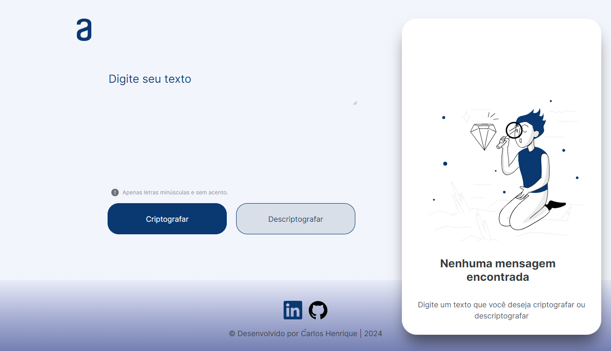

# Alura Challenge | Oracle One | Decodificador de texto

Sobre o projeto
---
Resultado desafio do programa ONE, da Oracle em parceria com a Alura:
- Decodificador de texto com desingn responsivo feito em HTML, CSS e JavaScript.

    

Chave de Critografia
---

As "chaves" de critografia utilizadas são: 
- A letra "e" é convertida para "enter" 
- A letra "i" é convertida para "imes" 
- A letra "a" é convertida para "ai" 
- A letra "o" é convertida para "ober" 
- A letra "u" é convertida para "ufat" 

Funcionalidade:
---
- Funciona apenas com letras minúsculas
- Não devem ser utilizados letras com acentos nem caracteres especiais, por exlemplo: ponto, vírgula, hastag, arroba, entre outros
- É possível converter uma palavra para a versão criptografada e também retornar uma palavra criptografada para a versão original.

Por exemplo:
"ilha" => "imeslhai"
"imeslhai" => "ilha"
"rato" => "raitober"
"raitober" => "rato"

Extra
---
- Um botão que copia o texto criptografado/descriptografado para a área de transferência, ou seja, que tenha a mesma funcionalidade do ctrl+C ou da opção "copiar" do menu dos aplicativos

GitHub Pages

--> https://carlosgomes07.github.io/Decodificador-de-texto/

Badge pela Conclusão do Desafio
---

